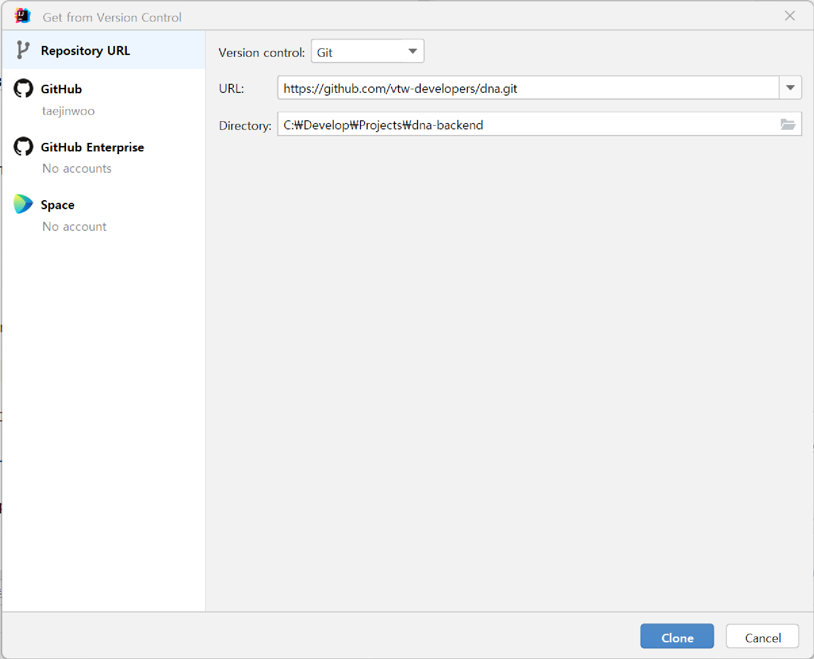
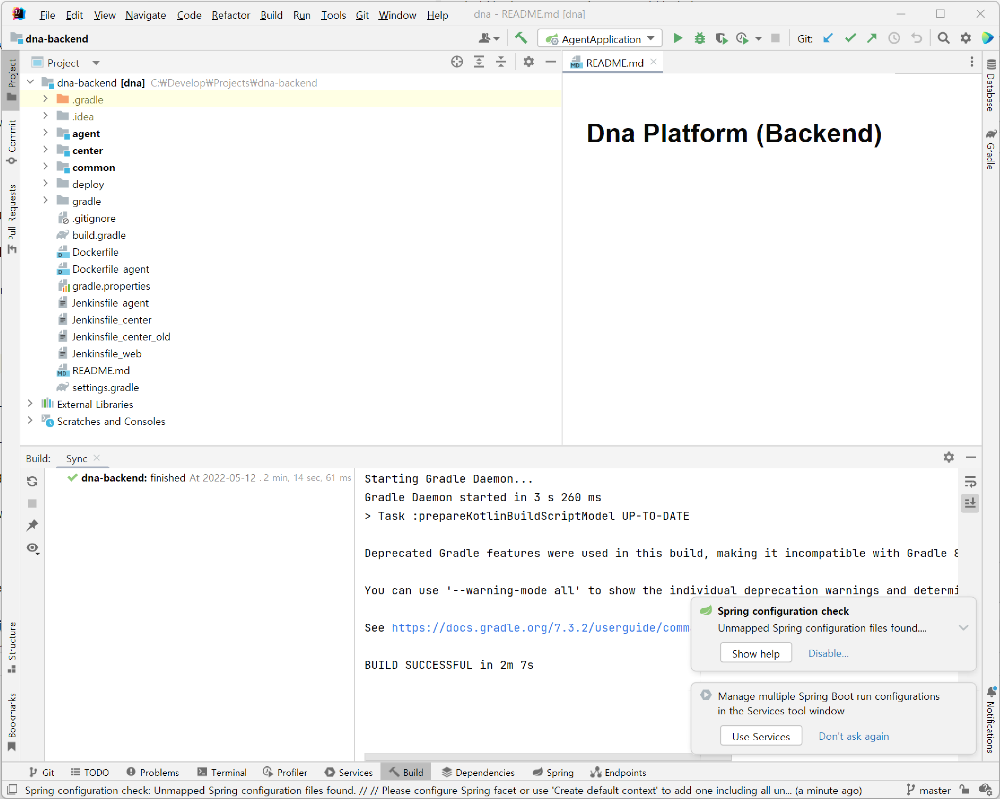
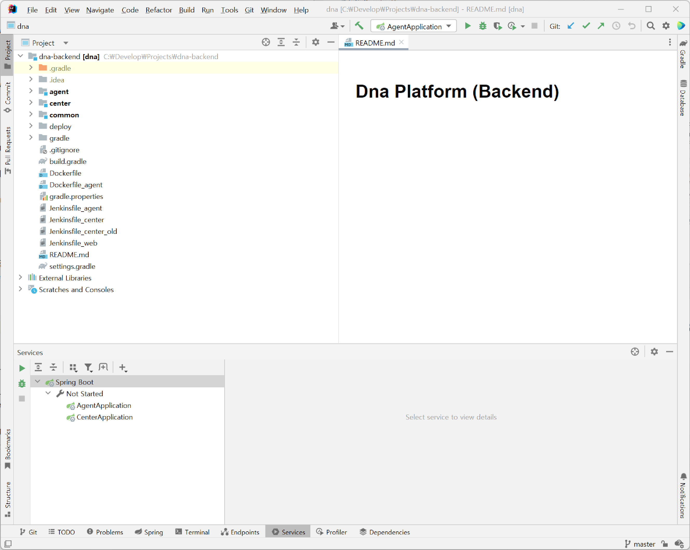
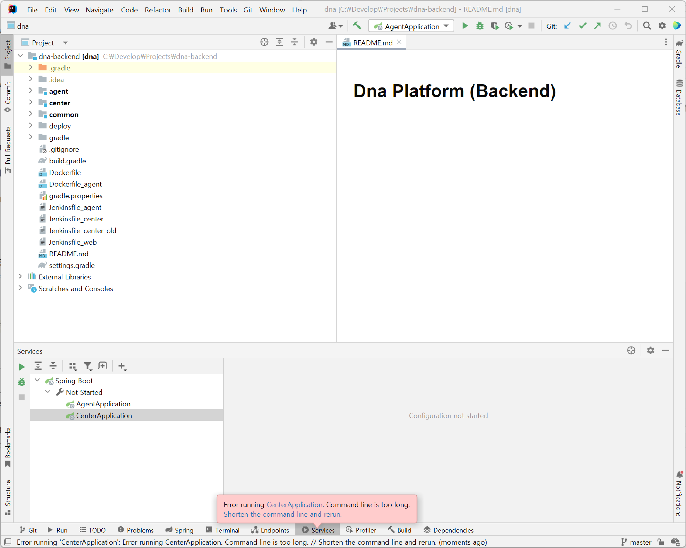
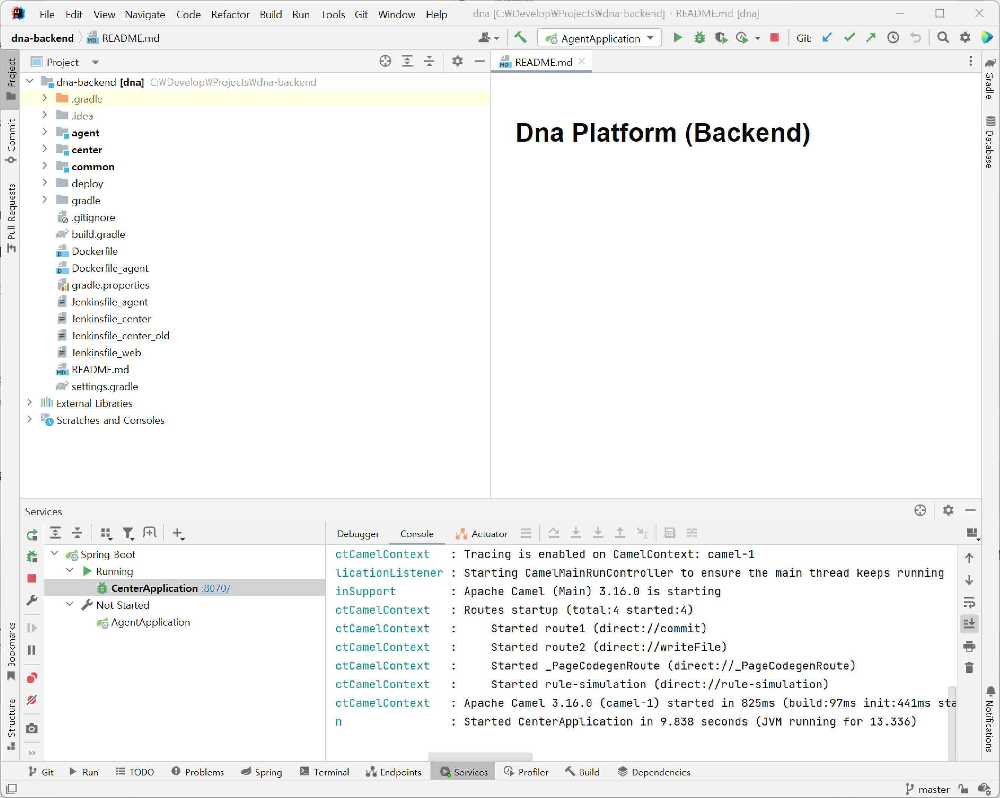

:spring_boot_version: 1.2.5.RELEASE
:jdk: https://www.oracle.com/kr/java/technologies/javase/jdk11-archive-downloads.html
:gs-maven: link:/guides/gs/maven
:gs-gradle: link:/guides/gs/gradle
:gs-consuming-rest: link:/guides/gs/consuming-rest
:images: https://raw.githubusercontent.com/spring-guides/gs-intellij-idea/master/images
= DnA플랫폼 개발환경 구성 (Backend)
:toc:
:icons: font
:source-highlighter: prettify
:project_id: gs-intellij-idea

이 문서는 Window11의 IntelliJ IDEA 상에서 DnA플랫폼 Backend를 실행하기 위한 가이드입니다.

== 사전준비

 - https://www.jetbrains.com/idea/download/[IntelliJ IDEA]
 - {jdk}[JDK 11]

== IntelliJ 프로젝트 생성하기

Github로부터 소스코드를 내려받고, IntelliJ의 프로젝트로 생성하는 과정입니다.

IntelliJ IDEA를 실행하고, 메인메뉴(상단)의 **File | New | Project from Version Control...** 로 이동합니다.

URL에 https://github.com/vtw-developers/dna.git 를 입력하고, Directory에 소스코드를 저장할 디렉터리를 설정한 다음 **Clone** 버튼을 클릭합니다.

프로젝트가 생성되면 자동으로 Gradle 빌드가 진행됩니다. 빌드가 완료되면 우측하단에 팝업창이 표시되는데, (첫번째는 Diasable... 처리하고,) 두번째 팝업의 User Services 버튼을 클릭합니다.

하단에 Services 탭이 나타나면 그 탭의 트리뷰에서 CenterApplication을 클릭하고, Debug 버튼을 클릭합니다.

Application 실행이 실패하면서 오류 팝업이 표시되는데 **Shorten the command line and rerun.** 링크를 클릭하면 다시 Application을 실행합니다.

Console창에 **Started CenterApplication ~**이라고 표시되면, 정상적으로 Center Application이 구동된 것입니다.

