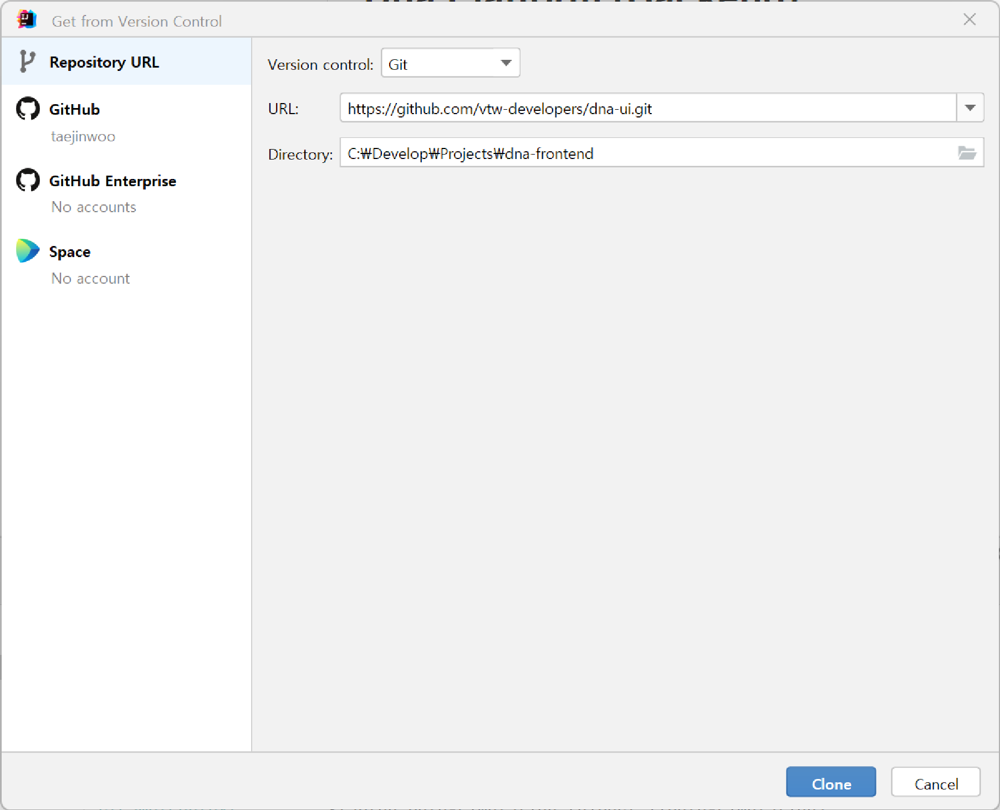
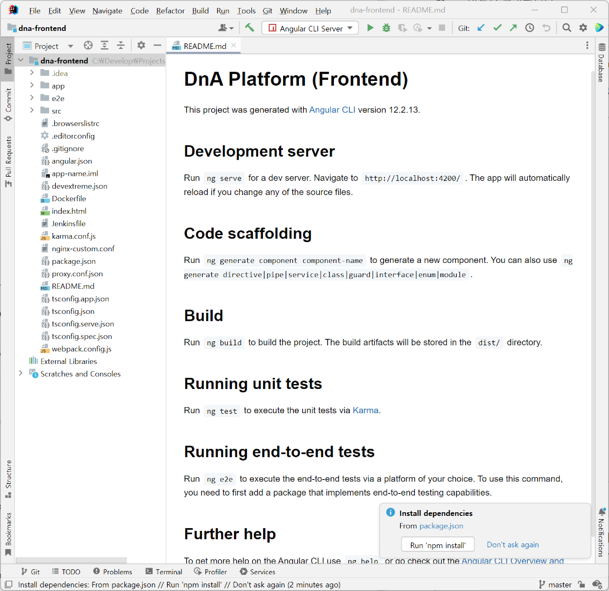

:nodejs: https://nodejs.org/ko/
= DnA플랫폼 개발환경 구성 (Frontend)
:toc:

이 문서는 Window11의 IntelliJ IDEA 상에서 DnA플랫폼 Frontend를 실행하기 위한 가이드입니다.

== 사전준비

- https://www.jetbrains.com/idea/download/[IntelliJ IDEA]
- {nodejs}[Node.js] (LTS 버전 권장)

== Angular CLI 설치

Node.js 설치 후 Command Line에서 아래와 같이 입력하여 Angular CLI를 설치합니다.

----
npm install -g @angular/cli
----

Anular CLI를 설치하기 전에 프로젝트를 설치할 경우 Angular 프로젝트로 인식 못하는 경우가 있으므로 IntelliJ를 실행하기 전에 설치하는 것을 권장합니다.

== IntelliJ 프로젝트 생성하기

Github로부터 소스코드를 내려받고, IntelliJ의 프로젝트로 생성하는 과정입니다.

IntelliJ IDEA를 실행하고, 메인메뉴(상단)의 **File | New | Project from Version Control...** 로 이동합니다. (IntelliJ를 처음 실행한 경우 Welcome 화면에서 **Get from Version Control**)

URL에 https://github.com/vtw-developers/dna-ui.git 를 입력하고, Directory에 소스코드를 저장할 디렉터리를 설정한 다음 **Clone** 버튼을 클릭합니다.

프로젝트가 생성되면 자동으로 빌드가 진행됩니다. 빌드가 완료되면 우측하단에 팝업창이 표시되는데, **Run 'npm install'** 버튼을 클릭하면 프로젝트에 node_modules 디렉터리에 필요한 라이브러리를 다운받게 됩니다.

설치 완료 후 하단 바의 Indexing dependencies까지 마치면 메인메뉴의 **Run | Run Angular CLI Server** 를 클릭하여 Frontend Application을 실행합니다. Console탭에 **'Compiled successfully.'** 가 표시되면 정상 구동된 것입니다. 웹브라우저에서 http://localhost:4200 으로 접속하면 DnA플랫폼 화면을 확인할 수 있습니다.

----
http://localhost:4200
----
